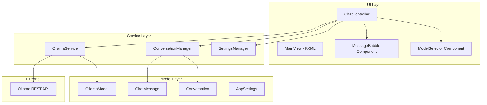

# Design Document: Ollama Chat Application

## Overview

This document describes the architecture and design for a JavaFX desktop application that enables users to chat with local LLM models via the Ollama API. The application follows a clean MVC-inspired architecture with clear separation between UI components, business logic, and API communication.

The design prioritizes:
- Clean, maintainable code structure
- Responsive UI with streaming support
- Robust error handling
- Testable components through dependency injection

## Architecture



### Layer Responsibilities

**UI Layer**: JavaFX components handling user interaction and display
- `MainView.fxml`: Layout definition for the main window
- `ChatController`: Handles UI events and coordinates between services
- `MessageBubble`: Custom component for rendering chat messages
- `ModelSelector`: Dropdown with model list and refresh capability

**Service Layer**: Business logic and external communication
- `OllamaService`: HTTP client for Ollama API communication
- `ConversationManager`: Manages chat history and message context
- `SettingsManager`: Persists and loads application settings

**Model Layer**: Data structures and domain objects
- `ChatMessage`: Represents a single message (role, content, timestamp)
- `OllamaModel`: Represents an available Ollama model (name, size)
- `Conversation`: Collection of messages with metadata
- `AppSettings`: Application configuration (host URL, window state)

## Components and Interfaces

### OllamaService

Handles all communication with the Ollama REST API.

```java
public interface OllamaService {
    /**
     * Fetches list of available models from /api/tags
     * @return CompletableFuture with list of OllamaModel
     */
    CompletableFuture<List<OllamaModel>> getAvailableModels();
    
    /**
     * Sends a chat request and returns streaming response
     * @param model The model name to use
     * @param messages List of conversation messages
     * @param onToken Callback for each streamed token
     * @return CompletableFuture that completes when streaming finishes
     */
    CompletableFuture<ChatMessage> sendChatMessage(
        String model, 
        List<ChatMessage> messages,
        Consumer<String> onToken
    );
    
    /**
     * Cancels any ongoing request
     */
    void cancelCurrentRequest();
    
    /**
     * Checks if Ollama is reachable
     * @return CompletableFuture with connection status
     */
    CompletableFuture<Boolean> checkConnection();
    
    /**
     * Sets the base URL for Ollama API
     * @param baseUrl The URL (default: http://localhost:11434)
     */
    void setBaseUrl(String baseUrl);
}
```

### ConversationManager

Manages the current conversation state and history.

```java
public interface ConversationManager {
    /**
     * Adds a message to the current conversation
     */
    void addMessage(ChatMessage message);
    
    /**
     * Gets all messages in the current conversation
     */
    List<ChatMessage> getMessages();
    
    /**
     * Clears the current conversation
     */
    void clearConversation();
    
    /**
     * Gets the current conversation for API requests (includes system prompt)
     */
    List<ChatMessage> getMessagesForApi();
    
    /**
     * Sets the system prompt
     */
    void setSystemPrompt(String prompt);
    
    /**
     * Saves conversation to file
     */
    void saveToFile(File file) throws IOException;
    
    /**
     * Loads conversation from file
     */
    void loadFromFile(File file) throws IOException;
}
```

### ChatController

Main controller coordinating UI and services.

```java
public class ChatController {
    // FXML injected components
    @FXML private ComboBox<OllamaModel> modelSelector;
    @FXML private VBox chatHistory;
    @FXML private ScrollPane chatScrollPane;
    @FXML private TextArea messageInput;
    @FXML private Button sendButton;
    @FXML private Label connectionStatus;
    @FXML private Button clearButton;
    @FXML private Button refreshButton;
    
    // Services
    private OllamaService ollamaService;
    private ConversationManager conversationManager;
    private SettingsManager settingsManager;
    
    // State
    private boolean isGenerating = false;
    
    public void initialize();
    public void onSendMessage();
    public void onClearChat();
    public void onRefreshModels();
    public void onModelSelected();
    public void onCancelGeneration();
}
```

### MessageBubble Component

Custom JavaFX component for displaying messages.

```java
public class MessageBubble extends HBox {
    public enum Role { USER, ASSISTANT, SYSTEM, ERROR }
    
    private final Label contentLabel;
    private final Label timestampLabel;
    private final Role role;
    
    public MessageBubble(ChatMessage message);
    
    /**
     * Appends text for streaming responses
     */
    public void appendText(String text);
    
    /**
     * Sets the complete message content
     */
    public void setContent(String content);
    
    /**
     * Shows/hides typing indicator
     */
    public void setTyping(boolean typing);
}
```

## Data Models

### ChatMessage

```java
public record ChatMessage(
    String role,           // "user", "assistant", "system"
    String content,        // Message text
    LocalDateTime timestamp,
    Long generationTimeMs  // Time to generate (for assistant messages)
) {
    public static ChatMessage user(String content) {
        return new ChatMessage("user", content, LocalDateTime.now(), null);
    }
    
    public static ChatMessage assistant(String content, long generationTimeMs) {
        return new ChatMessage("assistant", content, LocalDateTime.now(), generationTimeMs);
    }
    
    public static ChatMessage system(String content) {
        return new ChatMessage("system", content, LocalDateTime.now(), null);
    }
    
    /**
     * Converts to JSON format for Ollama API
     */
    public Map<String, String> toApiFormat() {
        return Map.of("role", role, "content", content);
    }
}
```

### OllamaModel

```java
public record OllamaModel(
    String name,
    String size,           // Human-readable size (e.g., "4.1 GB")
    long sizeBytes,
    String modifiedAt
) {
    @Override
    public String toString() {
        return name + " (" + size + ")";
    }
    
    /**
     * Parses from Ollama API response
     */
    public static OllamaModel fromJson(JsonObject json) {
        // Parse model details from /api/tags response
    }
}
```

### AppSettings

```java
public record AppSettings(
    String ollamaBaseUrl,
    double windowWidth,
    double windowHeight,
    double windowX,
    double windowY,
    String lastSelectedModel,
    String systemPrompt
) {
    public static AppSettings defaults() {
        return new AppSettings(
            "http://localhost:11434",
            900, 700, -1, -1,
            null, null
        );
    }
}
```

## API Communication

### Ollama API Endpoints

**GET /api/tags** - List available models
```json
{
  "models": [
    {
      "name": "llama2:latest",
      "size": 3826793472,
      "modified_at": "2024-01-15T10:30:00Z"
    }
  ]
}
```

**POST /api/chat** - Send chat message (streaming)
```json
// Request
{
  "model": "llama2",
  "messages": [
    {"role": "system", "content": "You are a helpful assistant."},
    {"role": "user", "content": "Hello!"}
  ],
  "stream": true
}

// Streaming Response (newline-delimited JSON)
{"message":{"role":"assistant","content":"Hello"},"done":false}
{"message":{"role":"assistant","content":"!"},"done":false}
{"message":{"role":"assistant","content":""},"done":true,"total_duration":1234567890}
```

### HTTP Client Implementation

Using Java's built-in `HttpClient` for async requests:

```java
public class OllamaServiceImpl implements OllamaService {
    private final HttpClient httpClient;
    private final ObjectMapper objectMapper;
    private String baseUrl = "http://localhost:11434";
    private HttpRequest currentRequest;
    
    public OllamaServiceImpl() {
        this.httpClient = HttpClient.newBuilder()
            .connectTimeout(Duration.ofSeconds(10))
            .build();
        this.objectMapper = new ObjectMapper();
    }
    
    @Override
    public CompletableFuture<List<OllamaModel>> getAvailableModels() {
        HttpRequest request = HttpRequest.newBuilder()
            .uri(URI.create(baseUrl + "/api/tags"))
            .GET()
            .build();
            
        return httpClient.sendAsync(request, HttpResponse.BodyHandlers.ofString())
            .thenApply(response -> parseModelsResponse(response.body()));
    }
    
    @Override
    public CompletableFuture<ChatMessage> sendChatMessage(
            String model, 
            List<ChatMessage> messages,
            Consumer<String> onToken) {
        // Build streaming request and process line by line
    }
}
```

## UI Layout

### Main Window Structure (FXML)

```
┌─────────────────────────────────────────────────────────────┐
│ ┌─────────────────────────────────────────────────────────┐ │
│ │ [Model Dropdown ▼] [↻ Refresh]      ● Connected         │ │ <- Toolbar
│ └─────────────────────────────────────────────────────────┘ │
├─────────────────────────────────────────────────────────────┤
│                                                             │
│                    ┌──────────────────┐                     │
│                    │   User Message   │                     │ <- Chat History
│                    └──────────────────┘                     │    (ScrollPane)
│  ┌──────────────────┐                                       │
│  │  AI Response     │                                       │
│  │  with markdown   │                                       │
│  └──────────────────┘                                       │
│                    ┌──────────────────┐                     │
│                    │   User Message   │                     │
│                    └──────────────────┘                     │
│  ┌──────────────────┐                                       │
│  │  ● ● ● typing... │                                       │
│  └──────────────────┘                                       │
│                                                             │
├─────────────────────────────────────────────────────────────┤
│ ┌─────────────────────────────────────────────────────────┐ │
│ │                                                         │ │ <- Input Area
│ │  Type your message... (Shift+Enter for newline)         │ │
│ │                                                         │ │
│ └─────────────────────────────────────────────────────────┘ │
│ [Clear] [Settings]                             [Send ➤]    │
└─────────────────────────────────────────────────────────────┘
```

### Styling

CSS classes for consistent theming:

```css
.chat-container { }
.message-bubble { }
.message-bubble-user { }
.message-bubble-assistant { }
.message-bubble-error { }
.message-timestamp { }
.typing-indicator { }
.toolbar { }
.input-area { }
.connection-status-connected { }
.connection-status-disconnected { }
```


## Correctness Properties

*A property is a characteristic or behavior that should hold true across all valid executions of a system—essentially, a formal statement about what the system should do. Properties serve as the bridge between human-readable specifications and machine-verifiable correctness guarantees.*

### Property 1: Model List Alphabetical Sorting

*For any* list of OllamaModel objects returned from the API, when displayed in the Model_Selector, the models SHALL be sorted alphabetically by name.

**Validates: Requirements 1.2**

### Property 2: Model Display Format

*For any* OllamaModel with a name and size, the display string (toString) SHALL contain both the model name and the human-readable size.

**Validates: Requirements 1.3**

### Property 3: Whitespace Message Rejection

*For any* string composed entirely of whitespace characters (including empty string), attempting to submit it as a message SHALL be rejected and the conversation state SHALL remain unchanged.

**Validates: Requirements 2.5**

### Property 4: Chronological Message Ordering with Timestamps

*For any* sequence of messages added to the ConversationManager, the messages SHALL be stored in chronological order and each message SHALL have a non-null timestamp.

**Validates: Requirements 4.1, 4.7**

### Property 5: Full Context in API Requests

*For any* conversation with N messages, when sending a new message, the API request SHALL include all N previous messages in the correct order.

**Validates: Requirements 4.3**

### Property 6: Clear Conversation Resets State

*For any* conversation with messages, after calling clearConversation(), the message list SHALL be empty and getMessages() SHALL return an empty list.

**Validates: Requirements 4.6**

### Property 7: Conversation Serialization Round-Trip

*For any* valid Conversation object, saving to a file and then loading from that file SHALL produce an equivalent Conversation with the same messages, timestamps, and metadata.

**Validates: Requirements 8.1, 8.3**

### Property 8: System Prompt First in API Requests

*For any* conversation with a system prompt set, when generating the API request messages, the system prompt SHALL be the first message in the list with role "system".

**Validates: Requirements 9.2**

### Property 9: Custom URL Configuration

*For any* valid URL string set via setBaseUrl(), subsequent API requests SHALL be made to that URL instead of the default localhost:11434.

**Validates: Requirements 5.7**

## Error Handling

### Connection Errors

| Error Type | Detection | User Feedback | Recovery |
|------------|-----------|---------------|----------|
| Ollama not running | ConnectException on API call | "Cannot connect to Ollama. Please ensure Ollama is running." | Retry button |
| Connection timeout | SocketTimeoutException | "Request timed out. Ollama may be busy." | Retry button |
| Invalid host URL | MalformedURLException | "Invalid Ollama URL configured." | Settings dialog |

### API Errors

| Error Type | Detection | User Feedback | Recovery |
|------------|-----------|---------------|----------|
| Model not found | 404 response | "Model not found. Please select a different model." | Model selector |
| Invalid request | 400 response | "Invalid request format." | Log details |
| Server error | 500 response | "Ollama server error. Please try again." | Retry button |

### Application Errors

| Error Type | Detection | User Feedback | Recovery |
|------------|-----------|---------------|----------|
| File save failed | IOException | "Failed to save conversation." | Retry with different location |
| File load failed | IOException/JsonParseException | "Failed to load conversation file." | Show error, keep current state |
| Invalid JSON response | JsonParseException | "Unexpected response from Ollama." | Log details, retry |

### Error Handling Strategy

```java
public class OllamaException extends Exception {
    public enum Type {
        CONNECTION_FAILED,
        TIMEOUT,
        MODEL_NOT_FOUND,
        INVALID_REQUEST,
        SERVER_ERROR,
        PARSE_ERROR
    }
    
    private final Type type;
    private final String userMessage;
    
    public OllamaException(Type type, String userMessage, Throwable cause) {
        super(userMessage, cause);
        this.type = type;
        this.userMessage = userMessage;
    }
}
```

## Testing Strategy

### Dual Testing Approach

This application uses both unit tests and property-based tests for comprehensive coverage:

- **Unit tests**: Verify specific examples, edge cases, and error conditions
- **Property tests**: Verify universal properties across randomly generated inputs

### Property-Based Testing Framework

**Framework**: jqwik (Java QuickCheck implementation)

**Configuration**:
- Minimum 100 iterations per property test
- Each test tagged with: `@Tag("Feature: ollama-chat, Property N: description")`

### Test Categories

#### Unit Tests

1. **OllamaService Tests**
   - Test successful model list parsing
   - Test connection error handling
   - Test timeout handling
   - Test JSON parsing edge cases

2. **ConversationManager Tests**
   - Test adding single message
   - Test clearing conversation
   - Test system prompt handling
   - Test empty conversation state

3. **ChatMessage Tests**
   - Test factory methods (user, assistant, system)
   - Test toApiFormat conversion
   - Test timestamp generation

4. **UI Controller Tests**
   - Test input validation
   - Test button state management
   - Test model selection handling

#### Property-Based Tests

1. **Property 1**: Model sorting - generate random model lists, verify sorted output
2. **Property 2**: Model display - generate models with various names/sizes, verify format
3. **Property 3**: Whitespace rejection - generate whitespace strings, verify rejection
4. **Property 4**: Message ordering - generate message sequences, verify order preserved
5. **Property 5**: Context inclusion - generate conversations, verify API payload
6. **Property 6**: Clear state - generate conversations, clear, verify empty
7. **Property 7**: Serialization round-trip - generate conversations, save/load, verify equality
8. **Property 8**: System prompt position - generate conversations with prompts, verify first
9. **Property 9**: URL configuration - generate valid URLs, verify endpoint changes

### Test File Structure

```
src/test/java/com/ollama/olama/
├── service/
│   ├── OllamaServiceTest.java
│   └── OllamaServicePropertyTest.java
├── model/
│   ├── ChatMessageTest.java
│   ├── OllamaModelTest.java
│   └── ConversationPropertyTest.java
├── manager/
│   ├── ConversationManagerTest.java
│   └── ConversationManagerPropertyTest.java
└── controller/
    └── ChatControllerTest.java
```

### Dependencies for Testing

```xml
<!-- Add to pom.xml -->
<dependency>
    <groupId>net.jqwik</groupId>
    <artifactId>jqwik</artifactId>
    <version>1.8.2</version>
    <scope>test</scope>
</dependency>
<dependency>
    <groupId>org.mockito</groupId>
    <artifactId>mockito-core</artifactId>
    <version>5.10.0</version>
    <scope>test</scope>
</dependency>
```
